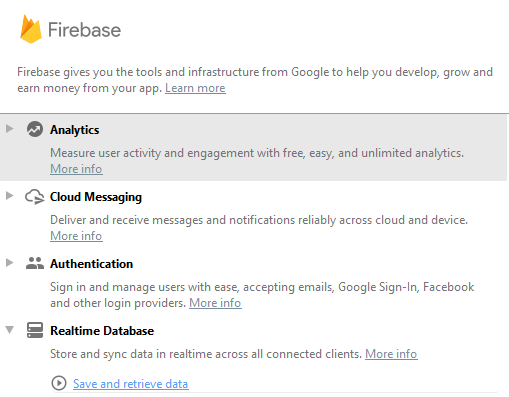
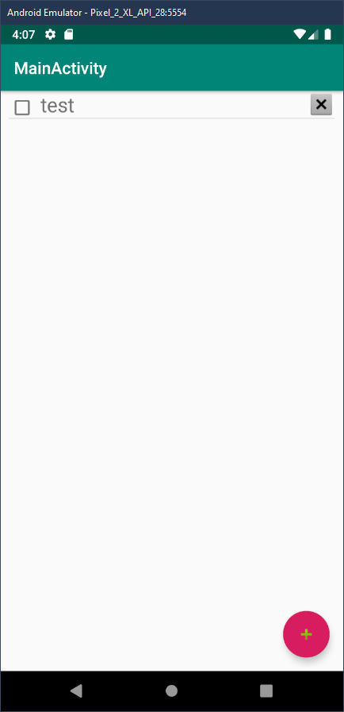

## Setup project

1. Create new project with basic template
2. Open Assistant view on menu Toos>Firebase and select `Save and retrieve data`
   

## Create Database

1. create Database on [firebase console](https://console.firebase.google.com/)
2. Add secure rule for database on **test mode**
3. Set server location
4. at `realtime database` / rule tab edit rule to

```json
{
  "rules": {
    ".read": true,
    ".write": true
  }
}
```

## create model

create new file name `ToDo.kt`

```kotlin
class ToDo {
    companion object Factory {
        fun create(): ToDo = ToDo()
    }

    var objectId: String? = null
    var todoText: String? = null
    var done: Boolean? = false
}
```

## Update layout

add Listview to `content_main.xml`

```xml
<?xml version="1.0" encoding="utf-8"?>
<androidx.constraintlayout.widget.ConstraintLayout xmlns:android="http://schemas.android.com/apk/res/android"
    xmlns:app="http://schemas.android.com/apk/res-auto"
    xmlns:tools="http://schemas.android.com/tools"
    android:layout_width="match_parent"
    android:layout_height="match_parent"
    app:layout_behavior="@string/appbar_scrolling_view_behavior"
    tools:context=".MainActivity"
    tools:showIn="@layout/activity_main">
    <ListView
        android:id="@+id/items_list"
        android:layout_width="match_parent"
        android:layout_height="match_parent"
        android:paddingLeft="10dp"
        android:paddingRight="10dp"
        android:scrollbars="none" />
</androidx.constraintlayout.widget.ConstraintLayout>
```

# Push new data to database

## Create Dialog

```kotlin
private fun addNewItemDialog() {
    // Create dialog
    val alert = AlertDialog.Builder(this)
    val itemEditText = EditText(this)
    alert.setMessage("Add New Item")
    alert.setTitle("Enter To Do Item Text")
    alert.setView(itemEditText)
    // Set submit button dialog
    alert.setPositiveButton("Submit") { dialog, positiveButton ->
        // puch command
    }
    alert.show()
}
```

add push command to submit button

```kotlin
    alert.setPositiveButton("Submit") { dialog, positiveButton ->
        // create new todoobject
        val todoItem = ToDo.create()
        todoItem.todoText = itemEditText.text.toString()
        todoItem.done = false
        // create new record
        val newItem = mDatabase.child("todo_item").push()
        // add new key to todoobject
        todoItem.objectId = newItem.key
        // set todoobject to new record on firebase db
        newItem.setValue(todoItem)
        // close dialog
        dialog.dismiss()
        // display data to user
        Toast.makeText(this,
            "Item saved with ID " + todoItem.objectId, Toast.LENGTH_SHORT).show()
    }
```

## Bind method to FAB

```kotlin
    fab.setOnClickListener { view ->
        addNewItemDialog()
    }
```

# Reading data from Firebase

Make a new file in res > layout folder and name it as `list_item.xml`

```xml
<?xml version="1.0" encoding="utf-8"?>
<LinearLayout xmlns:android="http://schemas.android.com/apk/res/android"
    xmlns:app="http://schemas.android.com/apk/res-auto"
    android:orientation="horizontal"
    android:layout_width="match_parent"
    android:layout_height="match_parent">

    <CheckBox
        android:id="@+id/cb_item"
        android:layout_width="wrap_content"
        android:layout_height="wrap_content"
        android:layout_marginTop="0dp"/>

    <TextView
        android:id="@+id/tv_item_text"
        android:layout_width="wrap_content"
        android:layout_height="wrap_content"
        android:layout_marginStart="6dp"
        android:layout_weight="1"
        android:text="Item Text"
        android:textSize="24sp" />
    <ImageButton
        android:id="@+id/iv_delete"
        android:layout_width="wrap_content"
        android:layout_height="wrap_content"
        android:contentDescription="Delete button"
        android:background="@android:color/transparent"
        android:gravity="end"
        app:srcCompat="@android:drawable/btn_dialog" />
</LinearLayout>
```

## create adapter

create todo adapter name `ToDoItemAdapter`

```kotlin
class ToDoItemAdapter(context: Context, toDoItemList: MutableList<ToDo>) : BaseAdapter() {

    private val mInflater: LayoutInflater = LayoutInflater.from(context)
    private var itemList = toDoItemList

    override fun getView(position: Int, convertView: View?, parent: ViewGroup?): View {
        // create object from view
        val objectId: String = itemList.get(position).objectId as String
        val itemText: String = itemList.get(position).todoText as String
        val done: Boolean = itemList.get(position).done as Boolean
        val view: View
        val vh: ListRowHolder

        // get list view
        if (convertView == null) {
            view = mInflater.inflate(R.layout.list_items, parent, false)
            vh = ListRowHolder(view)
            view.tag = vh
        } else {
            view = convertView
            vh = view.tag as ListRowHolder
        }

        // add text to view
        vh.label.text = itemText
        vh.isDone.isChecked = done
        return view
    }

    override fun getItem(index: Int): Any {
        return itemList.get(index)
    }

    override fun getItemId(index: Int): Long {
        return index.toLong()
    }

    override fun getCount(): Int {
        return itemList.size
    }

    private class ListRowHolder(row: View?) {
        val label: TextView = row!!.findViewById<TextView>(R.id.tv_item_text) as TextView
        val isDone: CheckBox = row!!.findViewById<CheckBox>(R.id.cb_item) as CheckBox
        val ibDeleteObject: ImageButton = row!!.findViewById<ImageButton>(R.id.iv_delete) as ImageButton
    }
}
```

## Fetching data from Firebase

add class attribute

```kt
var toDoItemList: MutableList<ToDo>? = null
lateinit var adapter: ToDoItemAdapter
private var listViewItems: ListView? = null
```

prepair object in onCreate

```kt
override fun onCreate(savedInstanceState: Bundle?) {
    ...

    mDatabase = FirebaseDatabase.getInstance().reference
    listViewItems = findViewById<View>(R.id.items_list) as ListView

    mDatabase = FirebaseDatabase.getInstance().reference
    toDoItemList = mutableListOf<ToDo>()
    adapter = ToDoItemAdapter(this, toDoItemList!!)
    listViewItems!!.setAdapter(adapter)
    mDatabase.orderByKey().addListenerForSingleValueEvent(itemListener)
}
```

create value listener

```kt
var itemListener: ValueEventListener = object : ValueEventListener {

    override fun onDataChange(dataSnapshot: DataSnapshot) {
        // call function
        addDataToList(dataSnapshot)
    }

    override fun onCancelled(databaseError: DatabaseError) {
        // Getting Item failed, display log a message
        Log.w("MainActivity", "loadItem:onCancelled", databaseError.toException())
    }
}
```

bind data to list

```kt
private fun addDataToList(dataSnapshot: DataSnapshot) {
    val items = dataSnapshot.children.iterator()
    // Check if current database contains any collection
    if (items.hasNext()) {
        val toDoListindex = items.next()
        val itemsIterator = toDoListindex.children.iterator()

        // check if the collection has any to do items or not
        while (itemsIterator.hasNext()) {
            // get current item
            val currentItem = itemsIterator.next()
            val map = currentItem.getValue() as HashMap<String, Any>
            // add data to object
            val todoItem = ToDo.create()
            todoItem.objectId = currentItem.key
            todoItem.done = map.get("done") as Boolean?
            todoItem.todoText = map.get("todoText") as String?
            toDoItemList!!.add(todoItem);
        }
    }
    //alert adapter that has changed and update
    adapter.notifyDataSetChanged()
}
```



# Update and Delete items

create interface name `ItemRowListener`

```kt
interface ItemRowListener {
    fun modifyItemState(itemObjectId: String, isDone: Boolean)
    fun onItemDelete(itemObjectId: String)
}
```

implement to `MainActivity`

```kt
class MainActivity : AppCompatActivity(), ItemRowListener {
    ...
}
```

now implement method from interface

```kt
override fun modifyItemState(itemObjectId: String, isDone: Boolean) {
    //get child reference in database via the ObjectID
    val itemReference = mDatabase.child("todo_item").child(itemObjectId)
    //set new value
    itemReference.child("done").setValue(isDone);
}

override fun onItemDelete(itemObjectId: String) {
    //get child reference in database via the ObjectID
    val itemReference = mDatabase.child("todo_item").child(itemObjectId)
    //deletion can be done via removeValue() method
    itemReference.removeValue()
}
```

now update `ToDoItemAdapter` in `getView()` to set listener to button

```kt
private var rowListener: ItemRowListener = context as ItemRowListener

override fun getView(position: Int, convertView: View?, parent: ViewGroup?): View {
    ...
    //add button listenner
    vh.isDone.setOnClickListener {
        rowListener.modifyItemState(objectId, !done)
    }

    vh.ibDeleteObject.setOnClickListener {
        rowListener.onItemDelete(objectId)
    }
    ...
}
```

# Conclusion

In this lesson, we looked at CRUD(Create, Read, Update, Delete) operations of Firebase and how fast it is to sync with web server. We completed CRUD operations in our elegant app and enjoyed it as well.
